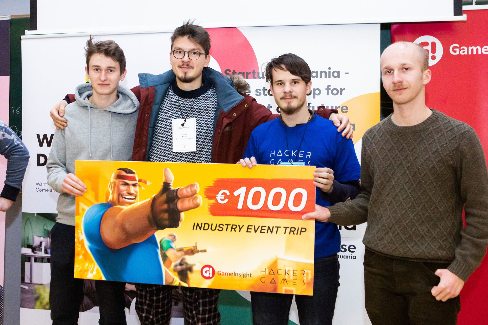

Hi, I'm Mykolas, a passionate developer from Vilnius, Lithuania. I mostly work with JavaScript and React 👩‍💻⚛️. Although I don't limit myself to any single technology, I'm just in general extremely interested in software development.

I wanted to share my journey so far in the world of software development and how I started working as a developer while still studying in high-school.

## How the journey started

I've always been interested in anything and everything technical. Computers, logic puzzles and games are the things that drew me to programming from quite an early age.

When I was around 14 I started getting into the basics of coding and JavaScript. The resources I started learning from were engaging, fun and helpful. I started from [code.org](https://code.org/), later I moved on to a course on JavaScript on [khanacademy.org](https://www.khanacademy.org/profile/WussTy/).

The beginner courses were great, but after a while, they weren't challenging enough and I lost interest for a little bit. I had to find something more _real_ and _useful_.

After coming back to coding after a short break and remembering how fun and rewarding it actually is I got the sudden urge to pursue software development as a career. A lot of work and learning was ahead of me 👨‍🎓💻.

<small>Programming has always been a social activity for me. Me on the left with friends participating in a hackathon.</small>

## Starting to take it more seriously

Looking back, I see that I did a couple of things quite right to get ready for working as a software developer.

### Online courses

I was around 15 when I received a membership for an online learning platform called [lynda.com](https://www.lynda.com/) (now LinkedIn Learning) as a gift. The \$40 or so that were invested in my learning have brought amazing returns. 📖🦄 Probably the best investment in my life.

I learned the very fundamental basics of how web software was built. Got introduced to HTML, CSS, and dove deeper into JavaScript, which was quickly becoming my favorite programming tool.

Not only were the courses of higher quality, but the fact that money was spent on getting the courses motivated me to complete them. This is why I'd recommend buying your courses. There are tons of great and free resources, but you're more likely to finish courses if you've actually 💸 **invested** 💸 monetarily in them.

In terms of web development, I'd really like to recommend the courses of [@wesbos](https://twitter.com/wesbos). They are really fun and extremely informative. They were quite transformational in my career and programming journey. The [courses](https://wesbos.com/courses/) related to JavaScript and that ecosystem have helped me especially. From small tips and tricks to project-based hands-on experience, those courses gave me a ton.

Online courses have always been a pretty big part of my learning process. Even today I try to allocate time to courses, they allow me to learn new things in a condensed and effective way. Improving, learning and picking up new skills is essential as a software developer.

### Attending events

Meetups, hackathons and in general any development related events were and still are something that is crucial in my learning process and career development.

#### Meetups

Generally, very informal and friendly events where you not only learn stuff but more importantly where you can meet other people from the industry.

There are plenty of platforms to find meetups in your city, [meetup.com](https://www.meetup.com/) is a great one. Events are often dedicated to a technology or a programming language, so choose the ones that interest you most.

Mostly JavaScript, React oriented meetups have helped me keep up to what's new out there, meeting new like-minded people was also great.

But _most importantly_ most meetups have free snacks and drinks 🌮🍩🥤.

There are no downsides to attending them, that's why you should.

#### Hackathons

**Hackathons are awesome!** 🌞

They _force_ you (in a very positive way) to sit down and build something from scratch. And building stuff is ultimately how you learn in software development.

It doesn't matter if you are an expert or a beginner in any technology. When there's excitement and accountability in a project you figure out a way to make it work 🐱‍💻. That's just human nature, we adapt, learn and adjust.

It might not be very comfortable in the begging, new people, new tasks, a strict deadline to get your work done as most hackathons take place during a single weekend. But coming out of your comfort zone is a great way to improve and learn.

Hackathons have taught me a lot of technical skills and I got to know some great friends through them. I also have even been fortunate enough to win a couple of them. Although the essence of the event is not to win, it's to create daring projects and to meet new people.

<small>Me on the left, very sleep deprived, but ultimately happy after winning with an amazing team.</small>

These various events, hackathons, and meetups have been so transformational in my life. If I would have been sitting at home, not participating in any social events, I would not have gotten the opportunities I got, I would not know the great people I got to know 😎🤜🤛🤓.

Even my career got kickstarted after I attended a hackathon, as I got my first internship in a tech company after participating in a hackathon organized by the company.

### Internship and work

I'm super thankful for the people who accepted me as an intern into their team. It was great to grow in a supportive environment. Having people believe in me when I barely knew anything about development meant everything to me as a young developer 🐣🐣.

There is no doubt in my mind that if the people around me weren't as supportive as they were I would've dropped this whole thing and never pursued it any further.

As an intern I wasn't making coffee or anything like that, I was doing the same things the other developers were doing. And I have to say that I have learned the most in terms of software development in the workplace.

I have been extremely fortunate in my programming journey to work and to learn from great people and professionals. Learning from more senior developers and mentors is something that is extremely useful for a younger programmer 👨💻 😄💻.

It's important to ask questions, share ideas, discuss code and different solutions. That's how you learn and improve, there is no better way than just doing, creating, and developing.

Having other people by your side that already went through the things you're going through in your programming journey is super helpful. These people can definitely assist you if you're feeling isolated or lost in this vast world.

I went from intern to junior developer, to mid developer in the same company, same supportive environment. And I've grown a ton in the many facets of a being a software developer.

## Next steps in my journey

I can see I've improved a whole lot over these last couple of years, but I hope that I never stop growing my knowledge base. Even though I've already started my career in software development, my next step is getting a traditional degree in computer science 🎓📚.

I feel that traditional academia will help me tremendously, not just in terms of knowledge but also in getting to know the world of technology more intimately and from a more theoretical level.

In the end, I hope the practical experience I've already gained and the more theory focused approach of traditional academia will help me create much better and more useful software.

---

Thanks for reading! If you found it interesting or useful be sure to share 😉.

---

The inspiration for this post was a blog post written by the amazing Lydia Hallie, [@theavocoder](https://www.instagram.com/theavocoder/).

[Advice From A 19 Year Old Girl & Software Developer](https://medium.com/@lydiahallie/advice-from-a-19-y-o-girl-software-developer-88737bcc6be5).
